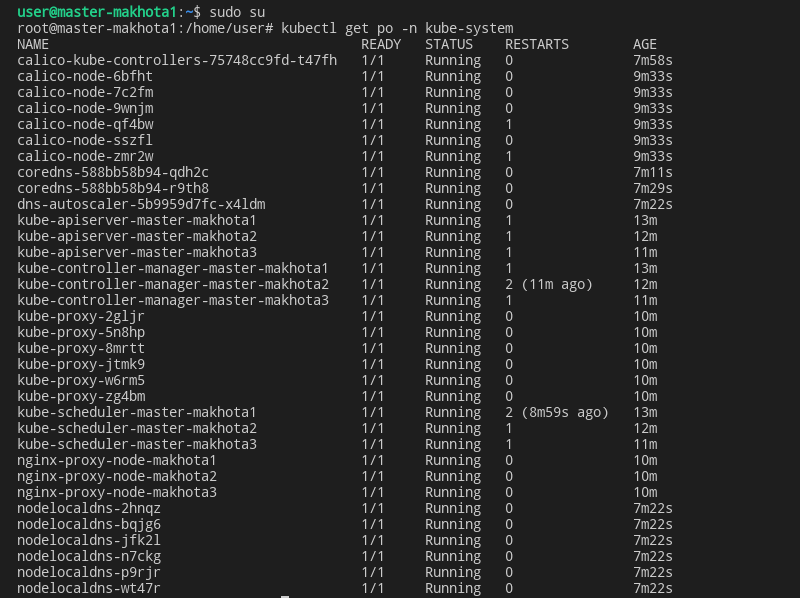
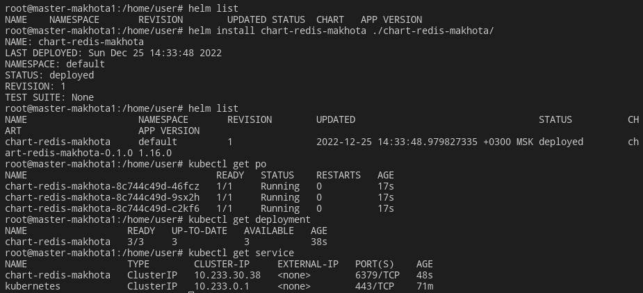

# Домашнее задание к занятию «6.6. Kubernetes. Часть 2» - `Елена Махота`


---

- [Ответ к Заданию 1](#1)
- [Ответ к Заданию 2](#2)
- [Ответ к Заданию 3*](#3)

---
### Задание 1

**Выполните действия:**

1. Создайте свой кластер с помощью kubeadm.
1. Установите любой понравившийся CNI плагин.
1. Добейтесь стабильной работы кластера.

В качестве ответа пришлите скриншот результата выполнения команды `kubectl get po -n kube-system`.

### *<a name="1">Ответ к Заданию 1</a>*

Создала 6 машин с помощью [terraform](terraform/main.tf), через который сразу поставила на машины  [docker](docker.sh), [kubeadm](kube.sh).


Установила kubernetes с использованием  ansible-playbook 
## `kubespray`

https://github.com/kubernetes-sigs/kubespray

```bash

git clone https://github.com/kubernetes-sigs/kubespray.git
cd ./kubespray
python3 -m pip install -r ./requirements.txt
cp -r ./inventory/sample/ ./inventory/myinv

```
В файле [/home/user/kubespray/inventory/myinv/inventory.ini](inventory.ini) указала свои машины:

```yaml
# ## Configure 'ip' variable to bind kubernetes services on a
# ## different ip than the default iface
# ## We should set etcd_member_name for etcd cluster. The node that is not a etcd member do not need to set the value, or can set the empty string value.
[all]
master-makhota1 ansible_host=10.128.0.103 ansible_ssh_private_key_file=/home/user/.ssh/id_rsa ansible_user=user ansible_python_interpreter=/usr/bin/python3
master-makhota2 ansible_host=10.128.0.10 ansible_ssh_private_key_file=/home/user/.ssh/id_rsa ansible_user=user ansible_python_interpreter=/usr/bin/python3
master-makhota3 ansible_host=10.128.0.11 ansible_ssh_private_key_file=/home/user/.ssh/id_rsa ansible_user=user ansible_python_interpreter=/usr/bin/python3
node-makhota1 ansible_host=10.128.0.200 ansible_ssh_private_key_file=/home/user/.ssh/id_rsa ansible_user=user ansible_python_interpreter=/usr/bin/python3
node-makhota2 ansible_host=10.128.0.201 ansible_ssh_private_key_file=/home/user/.ssh/id_rsa ansible_user=user ansible_python_interpreter=/usr/bin/python3
node-makhota3 ansible_host=10.128.0.202 ansible_ssh_private_key_file=/home/user/.ssh/id_rsa ansible_user=user ansible_python_interpreter=/usr/bin/python3

[kube_control_plane]
master-makhota1
master-makhota2
master-makhota3

[etcd]
master-makhota1
master-makhota2
master-makhota3

[kube_node]
node-makhota1
node-makhota2
node-makhota3
# node4
# node5
# node6

[calico_rr]

[k8s_cluster:children]
kube_control_plane
kube_node
calico_rr


```

Применила playbook 

```bash

ansible-playbook -i ./inventory/myinv/inventory.ini cluster.yml -b

```

В результате где-то за полчаса без моего участия кластер kubernetes установился


На машине `master-makhota1` перешла под рута `sudo su`, проверила системные поды `kubectl get po -n kube-system`




Плагин по умолчанию установился  calico.

Проверила созданные ноды.

```bash
kubectl get nodes
```


---

### Задание 2

Есть файл с деплоем:

```yaml
---
apiVersion: apps/v1
kind: Deployment
metadata:
  name: redis
spec:
  selector:
    matchLabels:
      app: redis
  replicas: 1
  template:
    metadata:
      labels:
        app: redis
    spec:
      containers:
      - name: master
        image: 
           env:
         - name: REDIS_PASSWORD
           value: password123
        ports:
        - containerPort: 6379
```
**Выполните действия:**

1. Создайте Helm Charts.
1. Добавьте в него сервис.
1. Вынесите все нужные, на ваш взгляд, параметры в `values.yaml`.
1. Запустите чарт в своём кластере и добейтесь его стабильной работы.

В качестве ответа пришлите вывод команды `helm get manifest <имя_релиза>`.

### *<a name="2">Ответ к Заданию 2</a>*

Установила `helm`

```bash

curl https://raw.githubusercontent.com/helm/helm/master/scripts/get-helm-3 | bash
helm version

```
Добавила `repo`

```bash

helm repo add stable https://charts.helm.sh/stable
helm repo list

```


Создала структуру чарта

```bash
mkdir chart-redis-makhota
cd ./chart-redis-makhota
mkdir templates
touch ./templates/deployment.yaml
touch ./templates/service.yaml
touch values.yaml
touch Chart.yaml
```
Внесла данные в файлы

[chart-redis-makhota/Chart.yaml](chart-redis-makhota/Chart.yaml)

```yaml

apiVersion: v2
name: chart-redis-makhota
description: A Helm chart for Kubernetes redis
type: application
version: 0.1.0
appVersion: "1.16.0"

```

[chart-redis-makhota/values.yaml](chart-redis-makhota/values.yaml)

```yaml

nameApp: chart-redis-makhota

image: redis:6.0.13

containerPort: 6379

targetPort: 6379

replicaCount: 3

specType: ClusterIP

```

[chart-redis-makhota/templates/deployment.yaml](chart-redis-makhota/templates/deployment.yaml)


```yaml

apiVersion: apps/v1
kind: Deployment
metadata:
  name: {{ .Values.nameApp }}
spec:
  selector:
    matchLabels:
      app: {{ .Values.nameApp }}
  replicas: {{ .Values.replicaCount }}
  template:
    metadata:
      labels:
        app: {{ .Values.nameApp }}
    spec:
      containers:
      - name: {{ .Values.nameApp }}
        image: {{ .Values.image }}
        ports:
        - containerPort: {{ .Values.containerPort }}

```

[chart-redis-makhota/templates/service.yaml](chart-redis-makhota/templates/service.yaml)

```yaml

apiVersion: v1
kind: Service
metadata:
  name: {{ .Values.nameApp }}
spec:
  type: {{ .Values.ClusterIP }}
  ports:
  - port: {{ .Values.containerPort }}
    targetPort: {{ .Values.targetPort }}
    name: {{ .Values.nameApp }}
  selector:
    app: {{ .Values.nameApp }}

```

Установила чат

```bash

helm install chart-redis-makhota ./chart-redis-makhota/

```

Проверила список чатов и работу подов





Результат команды `helm get manifest chart-redis-makhota`

```bash

root@master-makhota1:/home/user# helm get manifest chart-redis-makhota
---
# Source: chart-redis-makhota/templates/service.yaml
apiVersion: v1
kind: Service
metadata:
  name: chart-redis-makhota
spec:
  type: 
  ports:
  - port: 6379
    targetPort: 6379
    name: chart-redis-makhota
  selector:
    app: chart-redis-makhota
---
# Source: chart-redis-makhota/templates/deployment.yaml
apiVersion: apps/v1
kind: Deployment
metadata:
  name: chart-redis-makhota
spec:
  selector:
    matchLabels:
      app: chart-redis-makhota
  replicas: 3
  template:
    metadata:
      labels:
        app: chart-redis-makhota
    spec:
      containers:
      - name: chart-redis-makhota
        image: redis:6.0.13
        ports:
        - containerPort: 6379
```


---
## Дополнительные задания* (со звёздочкой)

Их выполнение необязательное и не влияет на получение зачёта по домашнему заданию. Можете их решить, если хотите лучше разобраться в материале.

---

### Задание 3*

1. Изучите [документацию](https://kubernetes.io/docs/concepts/storage/volumes/#hostpath) по подключению volume типа hostPath.
1. Дополните деплоймент в чарте подключением этого volume.
1. Запишите что-нибудь в файл на сервере, подключившись к поду с помощью `kubectl exec`, и проверьте правильность подключения volume.

В качестве ответа пришлите получившийся yaml-файл.


### *<a name="3">Ответ к Заданию 3*</a>*

Деинсталлировала чат из второго задания `chart-redis-makhota`

```bash

helm uninstall chart-redis-makhota

```

Скопировала файлы из директории `chart-redis-makhota` в директорию `chart-redis-makhota2`

Изменила [chart-redis-makhota2/values.yaml](chart-redis-makhota2/values.yaml)

```yaml

nameApp: chart-redis-makhota2

image: redis:6.0.13

containerPort: 6379

targetPort: 6379

replicaCount: 4

specType: ClusterIP

volumemountPath: /home/user/data

volumehostPath: /home/user/data

```

Дополнила [chart-redis-makhota2/templates/deployment.yaml](chart-redis-makhota2/templates/deployment.yaml) следующими строками для монтирования `volume`

```yaml

        volumeMounts:
        - mountPath: {{ .Values.volumemountPath }}
          name: mydir
      volumes:
      - name: mydir
        hostPath:
          # Ensure the file directory is created.
          path: {{ .Values.volumehostPath }}
          type: DirectoryOrCreate

```

Установила чат `chart-redis-makhota2`

```bash

helm install chart-redis-makhota2 ./chart-redis-makhota2

```

Посмотрела расширенную информацию о подах, в частности на каких нодах они запустились

```bash

kubectl get po -o wide

```

Зашла в последний под `chart-redis-makhota2-867d49c444-zhm56`, который запустился на машине `node-makhota3`, создала в папке, примонтированной к `volume` по адресу `/home/user/data/`, файл с выводом инофрмации о `hostname` пода.


Подключилась к машине  `node-makhota3` по ssh `ssh user@10.128.0.202`, проверила обновление информации из `volume`  `cat /home/user/data/infohost `


Результат команды `helm get manifest chart-redis-makhota2`

```bash

root@master-makhota1:/home/user# helm get manifest chart-redis-makhota2
---
# Source: chart-redis-makhota/templates/service.yaml
apiVersion: v1
kind: Service
metadata:
  name: chart-redis-makhota2
spec:
  type: 
  ports:
  - port: 6379
    targetPort: 6379
    name: chart-redis-makhota2
  selector:
    app: chart-redis-makhota2
---
# Source: chart-redis-makhota/templates/deployment.yaml
apiVersion: apps/v1
kind: Deployment
metadata:
  name: chart-redis-makhota2
spec:
  selector:
    matchLabels:
      app: chart-redis-makhota2
  replicas: 4
  template:
    metadata:
      labels:
        app: chart-redis-makhota2
    spec:
      containers:
      - name: chart-redis-makhota2
        image: redis:6.0.13
        ports:
        - containerPort: 6379
        volumeMounts:
        - mountPath: /home/user/data
          name: mydir
      volumes:
      - name: mydir
        hostPath:
          # Ensure the file directory is created.
          path: /home/user/data
          type: DirectoryOrCreate

```